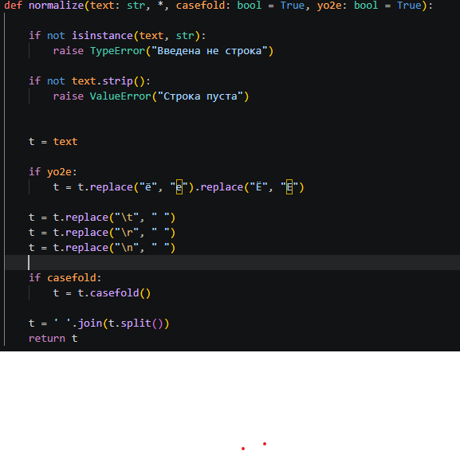
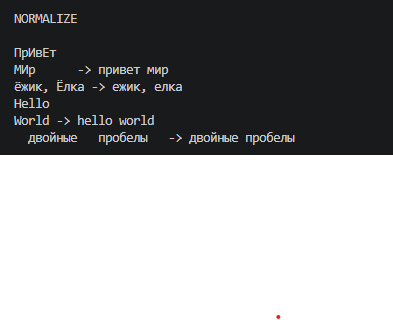
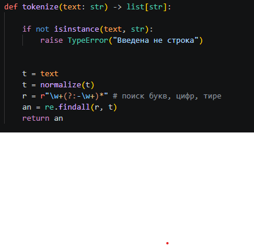
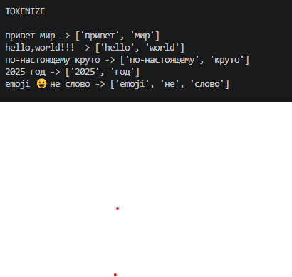
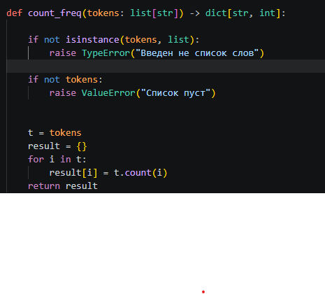
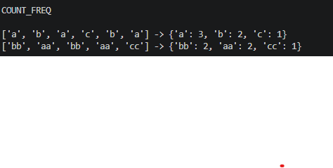
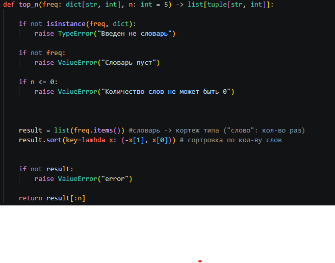
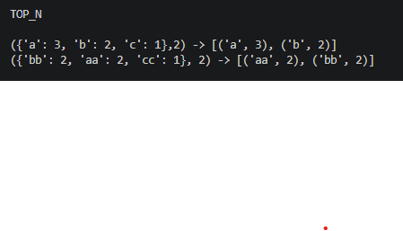
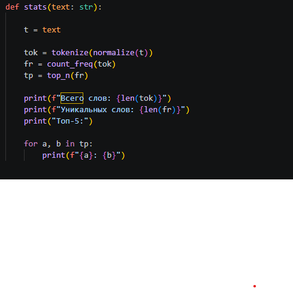
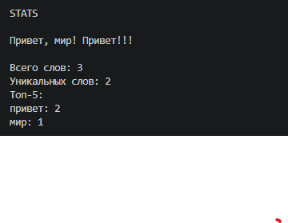

# Python Labs

## ЛР3 — Тексты и частоты слов (словарь/множество)

### Запуск кода осуществляется из корня репозитория >> py -m src.lab03.text_stats
---
## ЗАДАНИЕ A
### ФУНКЦИЯ NORMALIZE

### ВЫВОД

### ФУНКЦИЯ TOKENIZE

### ВЫВОД

### ФУНКЦИЯ COUNT_FREQ

### ВЫВОД

### ФУНКЦИЯ TOP_N

### ВЫВОД

---
## ЗАДАНИЕ B
### ФУНКЦИЯ STATS

### ВЫВОД

